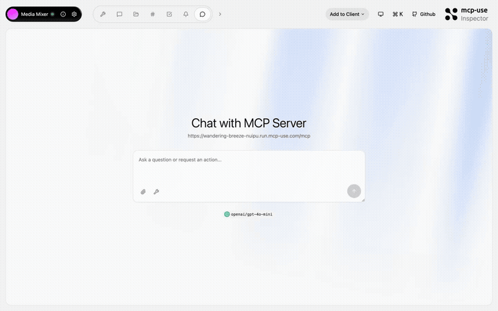

# Media Mixer — Rich media responses in your chat

<p>
  <a href="https://github.com/mcp-use/mcp-use">Built with <b>mcp-use</b></a>
  &nbsp;
  <a href="https://github.com/mcp-use/mcp-use">
    
  </a>
</p>

Showcase of rich media content types in MCP. Generate images (base64), audio, PDFs, HTML snippets, XML configs, stylesheets, scripts, and structured data — all returned as embedded content in tool responses.



## Try it now

Connect to the hosted instance:

```
https://wandering-breeze-nuipu.run.mcp-use.com/mcp
```

Or open the [Inspector](https://inspector.manufact.com/inspector?autoConnect=https%3A%2F%2Fwandering-breeze-nuipu.run.mcp-use.com%2Fmcp) to test it interactively.

### Setup on ChatGPT

1. Open **Settings** > **Apps and Connectors** > **Advanced Settings** and enable **Developer Mode**
2. Go to **Connectors** > **Create**, name it "Media Mixer", paste the URL above
3. In a new chat, click **+** > **More** and select the Media Mixer connector

### Setup on Claude

1. Open **Settings** > **Connectors** > **Add custom connector**
2. Paste the URL above and save

## Features

- **Image generation** — base64-encoded PNG images returned inline
- **Audio generation** — audio content in tool responses
- **PDF output** — generate PDF documents
- **HTML/CSS/JS snippets** — return styled web content
- **Structured data** — JSON arrays and XML configs
- **Multiple MIME types** — demonstrates all supported content types

## Tools

| Tool | Description |
|------|-------------|
| `generate-image` | Generate a sample image (base64 PNG) |
| `generate-audio` | Generate sample audio content |
| `generate-pdf` | Generate a sample PDF document |
| `get-report` | Get an HTML report |
| `get-html-snippet` | Get a styled HTML snippet |
| `get-xml-config` | Get an XML configuration |
| `get-stylesheet` | Get a CSS stylesheet |
| `get-script` | Get a JavaScript snippet |
| `get-data-array` | Get a structured JSON array |

## Local development

```bash
git clone https://github.com/mcp-use/mcp-media-mixer.git
cd mcp-media-mixer
npm install
npm run dev
```

## Deploy

```bash
npx mcp-use deploy
```

## Built with

- [mcp-use](https://github.com/mcp-use/mcp-use) — MCP server framework

## License

MIT
